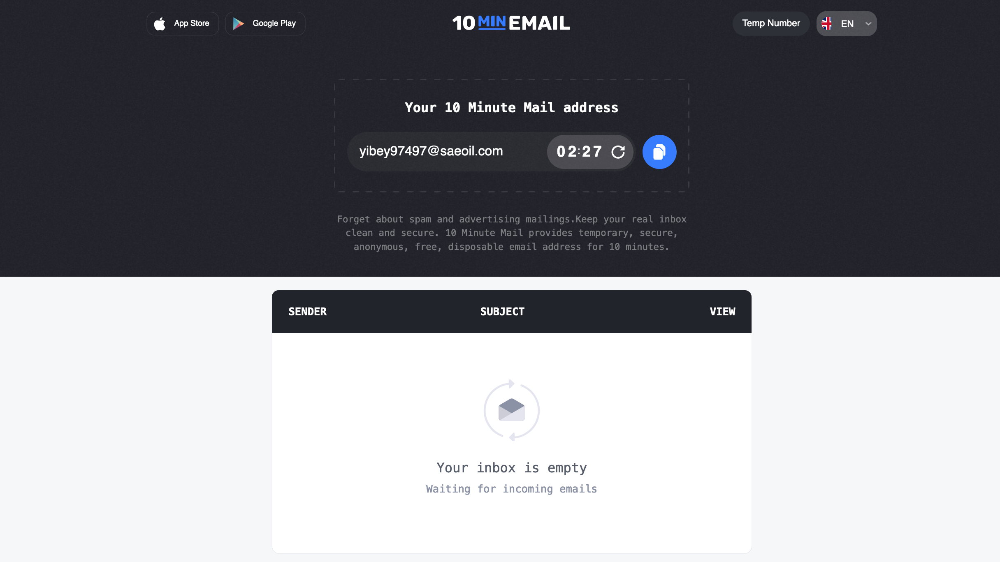
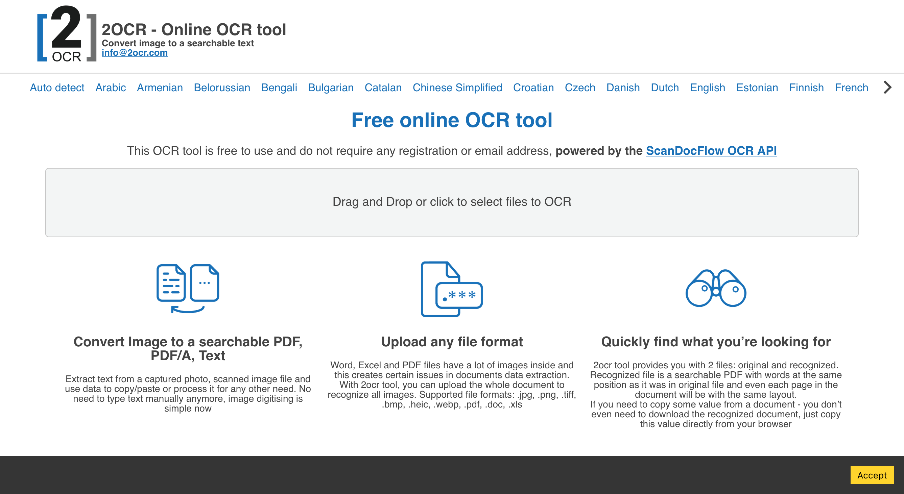
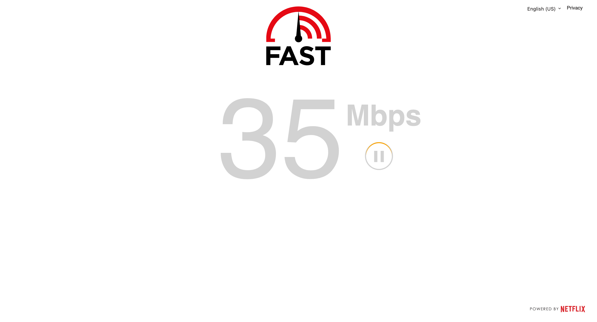
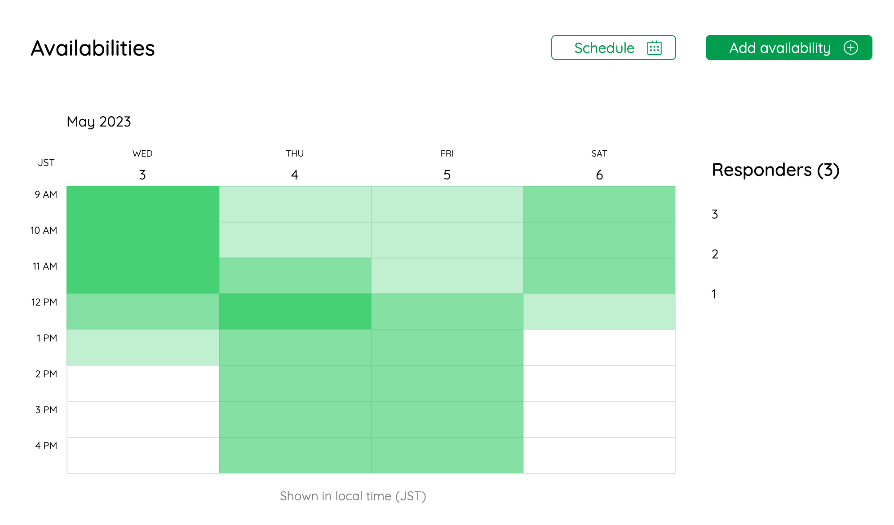
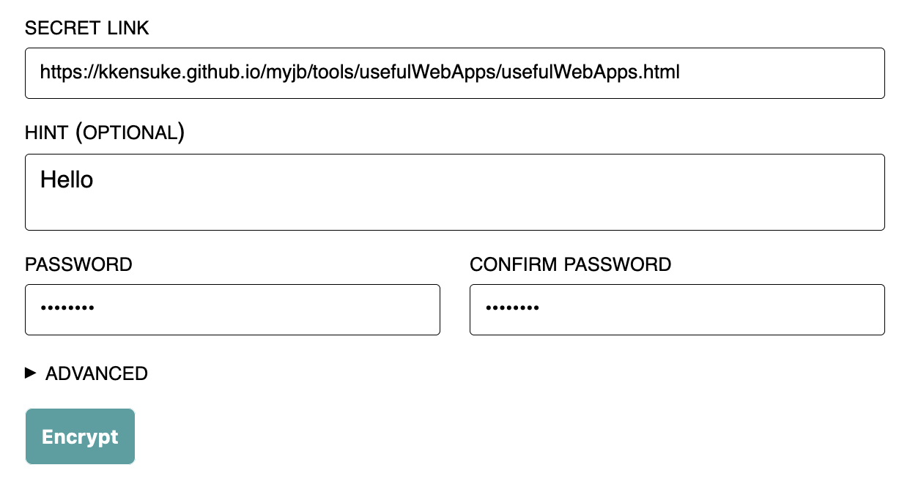
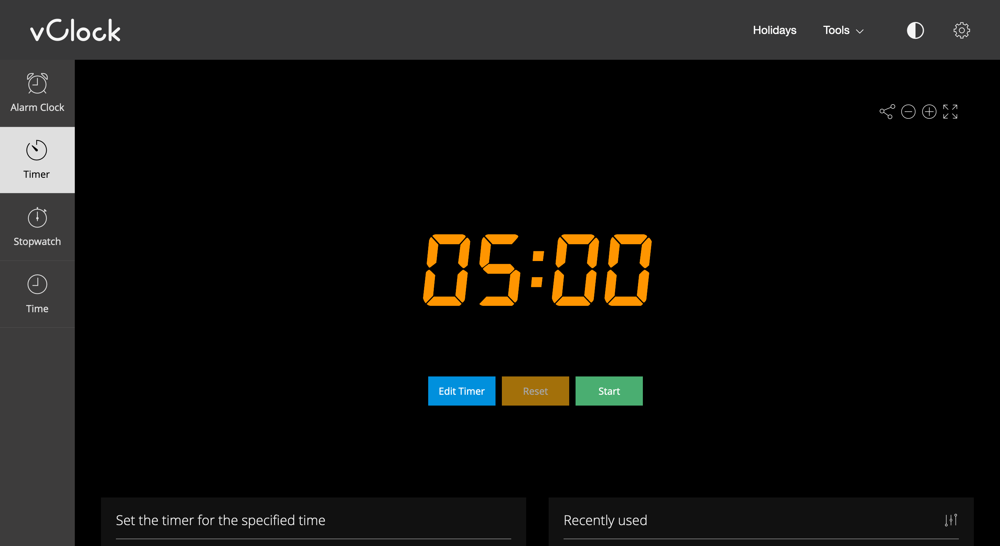
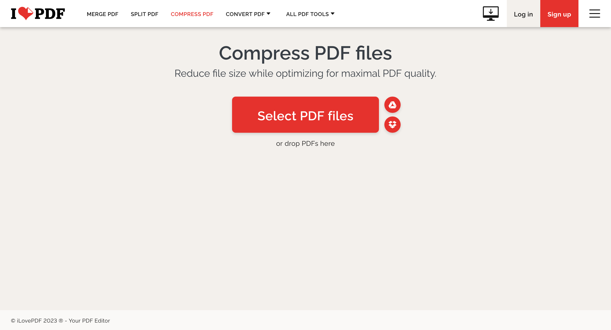

# Useful Web Apps

## [10 minutes mail](https://10minemail.com/en/)
You can get a temporary email address for 10 minutes. You can use it to sign up for a service not worth using your real email address. You can extend the time. There are many similar services.
<figure markdown>
  { width="700" }
  <figcaption></figcaption>
</figure>

## [2OCR](https://2ocr.com/)
You can convert images to text. It can detect multiple languages.
<figure markdown>
  { width="700" }
  <figcaption></figcaption>
</figure>

## [Internet speed test](https://fast.com/)
You can check your internet speed.
<figure markdown>
  { width="700" }
  <figcaption></figcaption>
</figure>

## [LettuceMeet](https://lettucemeet.com/)
You can schedule a meeting with your friends.
<figure markdown>
  { width="700" }
  <figcaption></figcaption>
</figure>

## [Link Lock](https://jstrieb.github.io/link-lock/create/)
You can lock a link with a password.
<figure markdown>
  { width="700" }
  <figcaption></figcaption>
</figure>

## [Online timer](https://vclock.com/timer/)
Online timer with simple UI.
<figure markdown>
  { width="700" }
  <figcaption></figcaption>
</figure>

## [PDF compressor](https://www.ilovepdf.com/compress_pdf)
Sometimes, lazy people send large PDF files to you. You can compress it with this service. There are many similar services, but this one is my favorite.
<figure markdown>
  { width="700" }
  <figcaption></figcaption>
</figure>